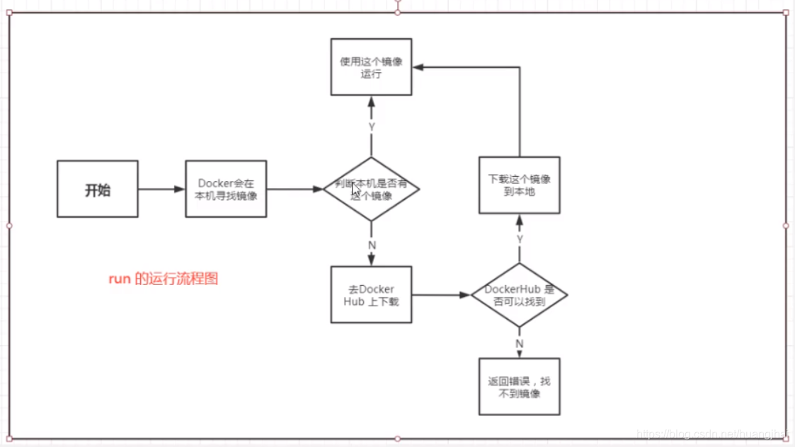
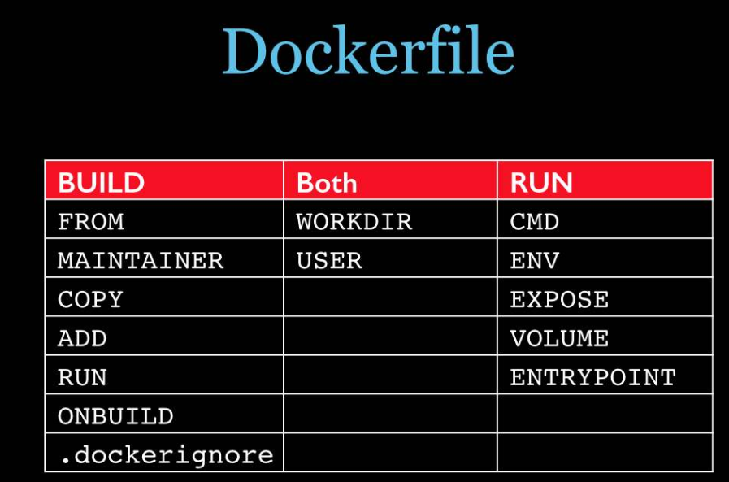

## Docker的安装 ##

1、先卸载docker相关配置

```shell
yum remove docker \
                  docker-client \
                  docker-client-latest \
                  docker-common \
                  docker-latest \
                  docker-latest-logrotate \
                  docker-logrotate \
                  docker-engine
```

2、下载需要的安装包

```shell
yum install -y yum-utils
```

3、设置阿里云的Docker镜像仓库

```shell
yum-config-manager \
    --add-repo \
    https://mirrors.aliyun.com/docker-ce/linux/centos/docker-ce.repo
```

4、更新yum软件包索引

```shell
yum makecache fast
```

5、安装docker 【docker-ce 是社区版，docker-ee 企业版】

```shell
 yum install docker-ce docker-ce-cli containerd.io
```

## Docker的基本组成

Docker的基本组成图如下：


## Docker容器运行流程

启动一个容器，Docker的运行流程如下图：



## Docker命令

Docker的命令结构图如下：


### 小结

```shell
attach    Attach to a running container                 # 当前 shell 下 attach 连接指定运行镜像 
build     Build an image from a Dockerfile              # 通过 Dockerfile 定制镜像 
commit    Create a new image from a container changes   # 提交当前容器为新的镜像 
cp        Copy files/folders from the containers filesystem to the host path   #从容器中拷贝指定文件或者目录到宿主机中 
create    Create a new container                        # 创建一个新的容器，同 run，但不启动容器 
diff      Inspect changes on a container's filesystem   # 查看 docker 容器变化 
events    Get real time events from the server          # 从 docker 服务获取容器实时事件 
exec      Run a command in an existing container        # 在已存在的容器上运行命令 
export    Stream the contents of a container as a tar archive   # 导出容器的内容流作为一个 tar 归档文件[对应 import ] 
history   Show the history of an image                  # 展示一个镜像形成历史 
images    List images                                   # 列出系统当前镜像 
import    Create a new filesystem image from the contents of a tarball # 从tar包中的内容创建一个新的文件系统映像[对应export] 
info      Display system-wide information               # 显示系统相关信息 
inspect   Return low-level information on a container   # 查看容器详细信息 
kill      Kill a running container                      # kill 指定 docker 容器 
load      Load an image from a tar archive              # 从一个 tar 包中加载一个镜像[对应 save] 
login     Register or Login to the docker registry server    # 注册或者登陆一个 docker 源服务器 
logout    Log out from a Docker registry server          # 从当前 Docker registry 退出 
logs      Fetch the logs of a container                 # 输出当前容器日志信息 
port      Lookup the public-facing port which is NAT-ed to PRIVATE_PORT    # 查看映射端口对应的容器内部源端口 
pause     Pause all processes within a container        # 暂停容器 
ps        List containers                               # 列出容器列表 
pull      Pull an image or a repository from the docker registry server   # 从docker镜像源服务器拉取指定镜像或者库镜像 
push      Push an image or a repository to the docker registry server    # 推送指定镜像或者库镜像至docker源服务器 
restart   Restart a running container                   # 重启运行的容器 
rm        Remove one or more containers                 # 移除一个或者多个容器 
rmi       Remove one or more images       # 移除一个或多个镜像[无容器使用该镜像才可删除，否则需删除相关容器才可继续或 -f 强制删除] 
run       Run a command in a new container              # 创建一个新的容器并运行一个命令 
save      Save an image to a tar archive                # 保存一个镜像为一个 tar 包[对应 load] 
search    Search for an image on the Docker Hub         # 在 docker hub 中搜索镜像 
start     Start a stopped containers                    # 启动容器 
stop      Stop a running containers                     # 停止容器 
tag       Tag an image into a repository                # 给源中镜像打标签 
top       Lookup the running processes of a container   # 查看容器中运行的进程信息 
unpause   Unpause a paused container                    # 取消暂停容器 
version   Show the docker version information           # 查看 docker 版本号 
wait      Block until a container stops, then print its exit code   # 截取容器停止时的退出状态值 
```


### 基础命令

```shell
docker version          #查看docker的版本信息
docker info             #查看docker的系统信息,包括镜像和容器的数量
docker 命令 --help       #帮助命令(可查看可选的参数)
docker COMMAND --help
```

命令的帮助文档地址:https://docs.docker.com/engine/reference/commandline/docker/

### 镜像命令

```shell
1、docker images 			#查看本地主机的所有镜像
2、docker search [key word]	 #搜索镜像
3、docker pull 镜像名[:tag]    #下载镜像
4、docker rmi 镜像id		   #删除镜像
5、docker history 镜像id	    #查看指定镜像的创建历史。
6、docker image inspect 镜像id  #查看镜像元数据
```

### 容器命令

```shell
1、docker run #创建一个新的容器并运行一个命令
	【实例】docker run --rm --name nginx-test -p 8080:80 -d nginx
	其中,该命令的四个命令行参数的含义如下。
      --rm 				#容器终止运行后，自动删除容器文件。
      --name nginx-test  #容器的名字叫做nginx-test,名字自己定义.
      -p				#端口进行映射，将本地 8080 端口映射到容器内部的 80 端口
      -d				#后台运行容器，并返回容器ID
      
2、docker ps #列出当前正在运行的容器
    -a   # 列出所有容器的运行记录
    -n=? # 显示最近创建的n个容器
    -q   # 只显示容器的编号  

3、docker rm 容器id #删除指定的容器,不能删除正在运行的容器,强制删除使用 rm -f
docker rm -f $(docker ps -aq)   #删除所有的容器
docker ps -a -q|xargs docker rm #删除所有的容器

4、启动和停止容器
docker start 容器id          #启动容器
docker restart 容器id        #重启容器
docker stop 容器id           #停止当前运行的容器
docker kill 容器id           #强制停止当前容器

5、docker rm -rf $(docker ps -a -q)	#一次性删除多个容器实例
```

### 常用命令

```shell
1、docker logs 容器id 	#日志的查看
	docker logs -tf 容器id
	docker logs --tail number 容器id #num为要显示的日志条数

2、docker top 容器id 	#查看容器中进程信息

3、docker inspect 容器id 	#查看容器的元数据

4、docker exec -it 容器id /bin/bash 	#进入容器后开启一个新的终端，可以在里面操作(常用)
	docker attach 容器id	#进入容器正在执行的终端，不会启动新的进程

5、docker cp 容器id:容器内路径  目的主机路径 	#拷贝容器的文件到主机中
	docker cp 目的主机路径 容器id:容器内路径		#拷贝宿主机的文件到容器中
	
6、docker commit -a "arsenal" -m "my nginx" e0363aa64eba mynginx:v1.0 	#从容器创建一个新的镜像。
```

## 数据卷

数据卷是一个可供一个或多个容器使用的特殊目录，它将主机操作系统目录直接映射进容器，

它可以提供很多有用的特性：
  1.数据卷 可以在容器之间共享和重用
  2.对数据卷的修改会立马生效
  3.对数据卷的更新，不会影响镜像
  4.数据卷 默认会一直存在，即使容器被删除

### 数据卷命令
```shell
1、docker run -it -v 主机目录:容器目录		#运行容器，指定挂载数据卷
#查看容器对应元数据docker inspect 容器id，可以在Mounts节点查看建立的数据卷信息。

2、docker volume create [数据卷名]		   #创建数据卷

3、docker volume ls					     #查看所有的数据卷

4、docker volume inspect [数据卷名]		   #查看指定数据卷的信息

5、docker volume rm  [数据卷名]			   #删除数据卷

6、docker volume prune		  			 #清理无主的数据卷

7、docker run -d -it --name tomcat01 --mount type=bind,source=my-vol:ro,target=/webapp centos:7
#启动一个挂载数据卷的容器

#注1：source=my-vol:ro
#    ro ----- readonly 只读。设置了只读则只能操作宿主机的路径，不能操作容器中的对应路径。
#    rw ----- readwrite 可读可写

#注2：source=my-vol:ro,target=/webapp
#    my-vol为要挂载的数据卷，如果数据卷不存在，docker会自动创建
#    /webapp为容器上目录，如果目录不存在， Docke会自动创建

#注3：mount选项高级用法
#  --mount选项的type参数支持三种类型的数据卷
#  --mount标志：由多个名值对组成，逗号分隔，每个键值由 <key> = <value> 元组组成
#  1.type=volume普通数据卷(默认即这种类型)，映射到主机/var/lib/docker/volumes路径下；
#	--mount type=volume,source=my-vol,target=/webapp
#	注：这是type的默认值
#  2.bind：绑定数据卷，映射到主机指定路径下；
#	--mount type=bind,source=/webapp,destination=/webapp2
#  3.tmpfs ：临时数据卷，只存在于内存中

8、docker run -it --name centos02 --volumes-from cnetos01 ethan/centos:1.0	
#通过参数--volumes-from，设置容器2和容器1建立数据卷挂载关系。
```

###  Dockerfile中设置数据卷

我们可以在Dockerfile中使用VOLUME指令来给镜像添加一个或多个数据卷。
下面使用Dockerfile构建一个新的镜像，dockerfile01文件的内容，匿名挂载了volume01和volume02两个目录：

```dockerfile
FROM centos

VOLUME ["volume01","volume02"]

CMD /bin/bash
```

## Dockerfile

Dockerfile是一个包含用于组合映像的命令的文本文档。可以使用在命令行中调用任何命令。 Docker通过读取Dockerfile中的指令自动生成映像。docker build命令用于从Dockerfile构建映像。可以在docker build命令中使用-f标志指向文件系统中任何位置的Dockerfile。

## Dockerfile 指令



| 关键字     | 说明                                                         |
| ---------- | :----------------------------------------------------------- |
| FROM       | 基础镜像，当前新镜像是基于哪个镜像的                         |
| MAINTAINER | 镜像维护者的姓名混合邮箱地址                                 |
| RUN        | 容器构建时需要运行的命令                                     |
| EXPOSE     | 当前容器对外保留出的端口                                     |
| WORKDIR    | 指定在创建容器后，终端默认登录的进来工作目录，一个落脚点     |
| ENV        | 用来在构建镜像过程中设置环境变量                             |
| ADD        | 将宿主机目录下的文件拷贝进镜像且ADD命令会自动处理URL和解压tar压缩包 |
| COPY       | 类似ADD，拷贝文件和目录到镜像中！                            |
| VOLUME     | 容器数据卷，用于数据保存和持久化工作                         |
| CMD        | 指定一个容器启动时要运行的命令，dockerFile中可以有多个CMD指令，但只有最后一个生效！ |
| ENTRYPOINT | 指定一个容器启动时要运行的命令！和CMD一样                    |
| ONBUILD    | 当构建一个被继承的DockerFile时运行命令，父镜像在被子镜像继承后，父镜像的 ONBUILD被触发 |

### Dockerfile示例

```dockerfile
# This my first nginx Dockerfile
# Version 1.0

# Base images 基础镜像
FROM centos

#MAINTAINER 维护者信息
MAINTAINER jack<centos@gmail.com> 

#ENV 设置环境变量
ENV PATH /usr/local/nginx/sbin:$PATH

#ADD  文件放在当前目录下，拷过去会自动解压
ADD nginx-1.8.0.tar.gz /usr/local/  
ADD epel-release-latest-7.noarch.rpm /usr/local/  

#RUN 执行以下命令 
RUN rpm -ivh /usr/local/epel-release-latest-7.noarch.rpm
RUN yum install -y wget lftp gcc gcc-c++ make openssl-devel pcre-devel pcre && yum clean all
RUN useradd -s /sbin/nologin -M www

#WORKDIR 相当于cd
WORKDIR /usr/local/nginx-1.8.0 

RUN ./configure --prefix=/usr/local/nginx --user=www --group=www --with-http_ssl_module --with-pcre && make && make install

RUN echo "daemon off;" >> /etc/nginx.conf

#EXPOSE 映射端口
EXPOSE 80

#CMD 运行以下命令
CMD ["nginx"]
```

### 常用命令详解和示例

**FROM：指定基础镜像，必须为第一个命令**

```dockerfile
格式：
　　FROM <image>
　　FROM <image>:<tag>
　　FROM <image>@<digest>示例：　　FROM mysql:5.6注：　　tag或digest是可选的，如果不使用这两个值时，会使用latest版本的基础镜像
```

**MAINTAINER: 维护者信息**

```dockerfile
格式：
    MAINTAINER <name>
示例：
    MAINTAINER Jasper Xu
    MAINTAINER sorex@163.com
    MAINTAINER Jasper Xu <sorex@163.com>
```

**RUN：构建镜像时执行的命令**

```dockerfile
RUN用于在镜像容器中执行命令，其有以下两种命令执行方式：
shell执行
格式：
    RUN <command>
exec执行
格式：
    RUN ["executable", "param1", "param2"]
示例：
    RUN ["executable", "param1", "param2"]
    RUN apk update
    RUN ["/etc/execfile", "arg1", "arg1"]
注：　　RUN指令创建的中间镜像会被缓存，并会在下次构建中使用。如果不想使用这些缓存镜像，可以在构建时指定--no-cache参数，如：docker build --no-cache
```

**ADD：将本地文件添加到容器中，tar类型文件会自动解压(网络压缩资源不会被解压)，可以访问网络资源，类似wget**

```dockerfile
格式：
    ADD <src>... <dest>
    ADD ["<src>",... "<dest>"] 用于支持包含空格的路径
示例：
    ADD hom* /mydir/          # 添加所有以"hom"开头的文件
    ADD hom?.txt /mydir/      # ? 替代一个单字符,例如："home.txt"
    ADD test relativeDir/     # 添加 "test" 到 `WORKDIR`/relativeDir/
    ADD test /absoluteDir/    # 添加 "test" 到 /absoluteDir/
```

**COPY：功能类似ADD，但是是不会自动解压文件，也不能访问网络资源**

**CMD：构建容器后调用，也就是在容器启动时才进行调用。**

```dockerfile
格式：
    CMD ["executable","param1","param2"] (执行可执行文件，优先)
    CMD ["param1","param2"] (设置了ENTRYPOINT，则直接调用ENTRYPOINT添加参数)
    CMD command param1 param2 (执行shell内部命令)
示例：
    CMD echo "This is a test." | wc -
    CMD ["/usr/bin/wc","--help"]注： 　　CMD不同于RUN，CMD用于指定在容器启动时所要执行的命令，而RUN用于指定镜像构建时所要执行的命令。
```

**ENTRYPOINT：配置容器，使其可执行化。配合CMD可省去"application"，只使用参数。**

```dockerfile
格式：
    ENTRYPOINT ["executable", "param1", "param2"] (可执行文件, 优先)
    ENTRYPOINT command param1 param2 (shell内部命令)
示例：
    FROM ubuntu
    ENTRYPOINT ["top", "-b"]
    CMD ["-c"]注：　　　ENTRYPOINT与CMD非常类似，不同的是通过docker run执行的命令不会覆盖ENTRYPOINT，而docker run命令中指定的任何参数，都会被当做参数再次传递给ENTRYPOINT。Dockerfile中只允许有一个ENTRYPOINT命令，多指定时会覆盖前面的设置，而只执行最后的ENTRYPOINT指令。
```

**LABEL：用于为镜像添加元数据**

```dockerfile
格式：
    LABEL <key>=<value> <key>=<value> <key>=<value> ...
示例：
　　LABEL version="1.0" description="这是一个Web服务器" by="IT笔录"
注：
　　使用LABEL指定元数据时，一条LABEL指定可以指定一或多条元数据，指定多条元数据时不同元数据之间通过空格分隔。推荐将所有的元数据通过一条LABEL指令指定，以免生成过多的中间镜像。
```

**ENV：设置环境变量**

```dockerfile
格式：
    ENV <key> <value>  #<key>之后的所有内容均会被视为其<value>的组成部分，因此，一次只能设置一个变量
    ENV <key>=<value> ...  #可以设置多个变量，每个变量为一个"<key>=<value>"的键值对，如果<key>中包含空格，可以使用\来进行转义，也可以通过""来进行标示；另外，反斜线也可以用于续行
示例：
    ENV myName John Doe
    ENV myDog Rex The Dog
    ENV myCat=fluffy
```

**EXPOSE：指定于外界交互的端口**

```dockerfile
格式：
    EXPOSE <port> [<port>...]
示例：
    EXPOSE 80 443
    EXPOSE 8080    EXPOSE 11211/tcp 11211/udp注：　　EXPOSE并不会让容器的端口访问到主机。要使其可访问，需要在docker run运行容器时通过-p来发布这些端口，或通过-P参数来发布EXPOSE导出的所有端口
```

**VOLUME：用于指定持久化目录**

```dockerfile
格式：
    VOLUME ["/path/to/dir"]
示例：
    VOLUME ["/data"]
    VOLUME ["/var/www", "/var/log/apache2", "/etc/apache2"注：　　一个卷可以存在于一个或多个容器的指定目录，该目录可以绕过联合文件系统，并具有以下功能：
1 卷可以容器间共享和重用
2 容器并不一定要和其它容器共享卷
3 修改卷后会立即生效
4 对卷的修改不会对镜像产生影响
5 卷会一直存在，直到没有任何容器在使用它
```

**WORKDIR：工作目录，类似于cd命令**

```dockerfile
格式：
    WORKDIR /path/to/workdir
示例：
    WORKDIR /a  (这时工作目录为/a)
    WORKDIR b  (这时工作目录为/a/b)
    WORKDIR c  (这时工作目录为/a/b/c)注：　　通过WORKDIR设置工作目录后，Dockerfile中其后的命令RUN、CMD、ENTRYPOINT、ADD、COPY等命令都会在该目录下执行。在使用docker run运行容器时，可以通过-w参数覆盖构建时所设置的工作目录。
```

**USER: ** 指定运行容器时的用户名或 UID，后续的 RUN 也会使用指定用户。使用USER指定用户时，可以使用用户名、UID或GID，或是两者的组合。当服务不需要管理员权限时，可以通过该命令指定运行用户。并且可以在之前创建所需要的用户

```dockerfile
 格式:
　　USER user
　　USER user:group
　　USER uid
　　USER uid:gid
　　USER user:gid
　　USER uid:group

 示例：
　　USER www

 注：

　　使用USER指定用户后，Dockerfile中其后的命令RUN、CMD、ENTRYPOINT都将使用该用户。镜像构建完成后，通过docker run运行容器时，可以通过-u参数来覆盖所指定的用户。
```

**ARG：用于指定传递给构建运行时的变量**

```
格式：
    ARG <name>[=<default value>]
示例：
    ARG site
    ARG build_user=www
```

**ONBUILD：用于设置镜像触发器**

```
格式：　　ONBUILD [INSTRUCTION]
示例：
　　ONBUILD ADD . /app/src
　　ONBUILD RUN /usr/local/bin/python-build --dir /app/src
注：　　当所构建的镜像被用做其它镜像的基础镜像，该镜像中的触发器将会被钥触发
```

 ## Docker网络

Docker默认提供了四个网络模式，说明：
    1、bridge：容器默认的网络是桥接模式(自己搭建的网络默认也是使用桥接模式,启动容器默认也是使用桥接模式)。此模式会为每一个容器分配、设置IP等，并将容器连接到一个docker0虚拟网桥，通过docker0网桥以及Iptables nat表配置与宿主机通信。
    2、none：不配置网络，容器有独立的Network namespace，但并没有对其进行任何网络设置，如分配veth pair 和网桥连接，配置IP等。
    3、host：容器和宿主机共享Network namespace。容器将不会虚拟出自己的网卡，配置自己的IP等，而是使用宿主机的IP和端口。
    4、container：创建的容器不会创建自己的网卡，配置自己的IP容器网络连通。容器和另外一个容器共享Network namespace（共享IP、端口范围）。

容器默认使用bridge网络模式，我们使用该docker run --network=选项指定容器使用的网络：
    host模式：使用 --net=host 指定。
    none模式：使用 --net=none 指定。
    bridge模式：使用 --net=bridge 指定，默认设置。
    container模式：使用 --net=container:NAME_or_ID 指定。

### 常用命令

```shell
1、docker network ls					#查看所有网络

2、docker network inspect [网络id]		#查看网络信息

3、docker network create --driver bridge --subnet 192.168.0.0/16 --gateway 192.168.0.1 mynet
#自定义一个网络
#	--driver bridge   #指定bridge驱动程序来管理网络
#	--subnet 192.168.0.0/16 #指定网段的CIDR格式的子网
#	--gateway 192.168.0.1 	#指定主子网的IPv4或IPv6网关

```

